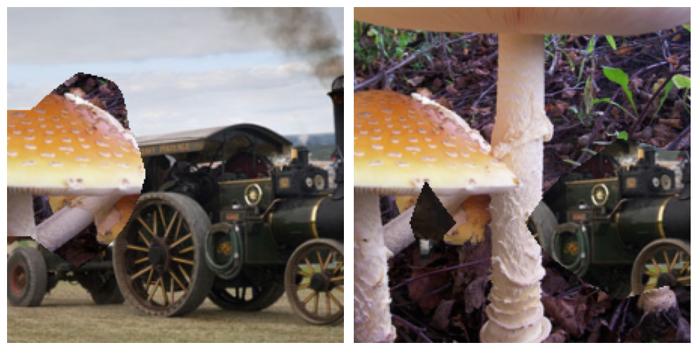

# Concept Mask-Awared Pruning and Augmentation for Few Sample Model Compression
## 1. State
- This is the official implementation of CMa-FSMC.
- We have also implemented MiR and PARCTISE (unofficial).
## 2. Main contributions
- **Empirically valid concept mask utility.** Visualization per channel confirmed concept masks' critical role,  showing easily removable blocks minimally affect ROI transfer. Thus, concept masks effectively guide pruning configuration and input sample optimization.
- **Propose CMa Pruning.** We quantified the pruning sensitivity of blocks using concept masks, and then performed block- or filter- pruning. To the best of our knowledge, this paper is the first work on optimizing pruning configuration for filter-level pruning in the field of FSMC.
- **Design CMaMix.** We use the concept mask of the aggregated output of the teacher's last convolutional layer to mix the input images, which is more intuitive and effective than the mainstream data augmentation methods and improves the sample diversity.
- **Achieve SOTA performance.** The performance of CMa-FSMC is verified on three models, as well as two DL tasks (image classification and semantic segmentation). The experimental results show that it is superior to the existing methods in all FSMC tasks.
## 3. Requirements
- pytorch
- pytorchcv
- thop
- torchvision
- PIL
- numpy
- tqdm
- logging
- datetime
- pytz
## 4. Reproduce our results
### (1) Classification
```
python main.py --model resnet34 --num_sample 50 --dataset imagenet --data_root /your/datasets/path/ --target_drf 0.252 --target_drp 0.232 --tag id-1 --seed 2021
```
The above command requires that you must provide the reduction rate of FLOPs and parameters in order to compare with other methods. If you want to run it independently for 5 times, please note to change the random number seed:
```
python main.py --model resnet34 --num_sample 50 --dataset imagenet --data_root /your/datasets/path/ --target_drf 0.252 --target_drp 0.232 --tag id-1 --seed 2021 >logs/CMa-resnet34-imagenet-50-drf-0.252-drp-0.232-id-1.txt 2>&1 &&
python main.py --model resnet34 --num_sample 50 --dataset imagenet --data_root /your/datasets/path/ --target_drf 0.252 --target_drp 0.232 --tag id-2 --seed 2022 >logs/CMa-resnet34-imagenet-50-drf-0.252-drp-0.232-id-2.txt 2>&1 &&
python main.py --model resnet34 --num_sample 50 --dataset imagenet --data_root /your/datasets/path/ --target_drf 0.252 --target_drp 0.232 --tag id-3 --seed 2023 >logs/CMa-resnet34-imagenet-50-drf-0.252-drp-0.232-id-3.txt 2>&1 &&
python main.py --model resnet34 --num_sample 50 --dataset imagenet --data_root /your/datasets/path/ --target_drf 0.252 --target_drp 0.232 --tag id-4 --seed 2024 >logs/CMa-resnet34-imagenet-50-drf-0.252-drp-0.232-id-4.txt 2>&1 &&
python main.py --model resnet34 --num_sample 50 --dataset imagenet --data_root /your/datasets/path/ --target_drf 0.252 --target_drp 0.232 --tag id-5 --seed 2025 >logs/CMa-resnet34-imagenet-50-drf-0.252-drp-0.232-id-5.txt 2>&1 &
```
The running logs will be stored in the *logs* folder. At the end of each command is &&, which indicates serial operation. If you want to run it in parallel, you can change it to &.

### (2) Segmentation
```
python main.py --model fcn_resnet101 --target_drf 0.192 --target_drp 0.200 --num_sample 50 --dataset voc2012 --data_root /your/datasets --eval_frequency 200 --train_batch_size 8 --train_workers 0 --lr 0.001 --tag id-1
```
You can run the above command to perform the compression of the semantic segmentation model FCN-ResNet101. Commands that run independently multiple times are similar to classification tasks.
```
python baseline.py --model fcn_resnet101 --pr 0.5 --num_sample 50 --dataset voc2012 --data_root /your/datasets/ --eval_frequency 200 --train_batch_size 8 --train_workers 0 --lr 0.001 --tag id-1
python MiR.py --model fcn_resnet101 --pr 0.5 --num_sample 50 --dataset voc2012 --data_root /your/datasets/ --eval_frequency 200 --train_batch_size 8 --train_workers 0 --lr 0.001 --tag id-1
python PRACTISE.py --model fcn_resnet101 --num_del_block 3 --num_sample 50 --dataset voc2012 --data_root /your/datasets/ --eval_frequency 200 --train_batch_size 8 --train_workers 0 --lr 0.001 --tag id-1 
```
You can also run the above commands to obtain the result of comparison methods.
### (3) Ablation
Our ablation experiments are conducted on the ResNet34 model. You can run the following command to obtain the ablation result:
```
# CMa Pruning + MixUp
python ablation.py --num_sample 50 --pruner CMa --trainer MiR-mixup
# CMa Pruning + CutMix
python ablation.py --num_sample 50 --pruner CMa --trainer MiR-cutmix
# CMa Pruning + GridMix
python ablation.py --num_sample 50 --pruner CMa --trainer MiR-gridmix
# CMa Pruning + CMaMix
python ablation.py --num_sample 50 --pruner CMa --trainer MiR-cma
# baseline Pruning + MixUp
python ablation.py --num_sample 50 --pruner baseline --trainer MiR-mixup
# baseline Pruning + CutMix
python ablation.py --num_sample 50 --pruner baseline --trainer MiR-cutmix
# baseline Pruning + GridMix
python ablation.py --num_sample 50 --pruner baseline --trainer MiR-gridmix
# baseline Pruning + CMaMix
python ablation.py --num_sample 50 --pruner baseline --trainer MiR-cma
```
### (4) Other explanations
- The *script* folder provides our run command, but it cannot be used directly. You need to replace the dataset path.
- For filter-level compression, CMa-FSMC needs to search for the optimal pruning configuration, which is stored in the *configs* folder. Therefore, your run does not need to search again. If you care about the search process, you can delete the *configs* folder and then run.
## 5. Visualization
You can view/run *visuailzation/DataAugmentation.ipynb* to understand the computing mechanism of concept mask and visual effect, is as follows:
